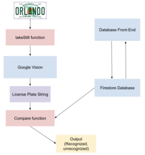

# <b>Vehicle Entry and Identification System</b>
## <b>1. Initial Problem: Gate Security</b>
My dad owns a property that has a keypad and gate that determines who gains entry to the property. Users of the property are given a code. The code has been shared to others, who were able to open the gate without payment.
  
## <b>2. Solution: Parameters</b>
A solution to this problem should:
<ol type="a">
  <li>Prevent unauthorized people from gaining access to the property</li>
  <li>Allow registered users to easily access the property</li>
  <li>Have remotely updatable permissions for users</li>
  <li>Operate in a timely manner (equivalent to or less than time to input a code)</li>
  <li>Not require manpower to operate</li>
</ol>

### <b>2.1. Solution: High Level Overview</b>
My solution to this problem involves a Raspberry Pi. The Raspberry Pi is connected to a camera that provides the visual input necessary to view license plates. These license plates are then fed into an AI model that utilizes Google Vision to translate the picture into text. As for data, I used Google Firebase for an online database that stores all registered users. It stores names and license plates, although it can easily be expanded to store more information. This online database is displayed onto an online website using HandsonTable, which makes the data easily editable and displays it as a spreadsheet. Changes on the table will be stored onto the database. The text is compared to the live database, and if it has a match, then it acknowledges the match (gate-control capabilities have not been implemented).

### <b>2.2 Solution: License Plate Reader</b>
The license plate reading capabilities were largely developed according to a tutorial on Youtube. It utilizes the Cloud Vision API, taking pictures and processing them through a text detection algorithm.

### <b>2.3 Solution: Database</b>
The database is hosted on Google Firebase. It stores users' First Names, Last Names, License Plates, and a unique ID assigned to each user for demonstration, although it can easily be expanded to accommodate more properties (phone numbers, email addresses, etc). This data is remotely accessible from the Raspberry Pi. Alongside the database is a website that displays the data. The data is displayed using HandsonTable, which puts the data in a spreadsheet-like format. This is preferable as it would be more accessible for editing and reviewing information. Edits on the table can be saved into the database through clicking the save button.
  
## <b>3. Considerations</b>

### <b>3.1 Usage</b>
This was designed with ease of use as one of the priorities. Users who would like to get into the property now do less for entry, and owners who would like to modify users could do so with relative ease, interacting with a familiar tool (spreadsheets).

### <b>3.2 Security</b>
While the Raspberry Pi can identify registered and unregistered license plates, ensuring secured access to the property, there is no current protection of the data on the front end. Securing the front end would be one priority of any future revision/development of the project.

### <b>3.3 Gate Control</b>
The Raspberry Pi is not currently capable of controlling doors/gates. In a future revision of the project, a gate remote may be used. Another possibility is using APIs to control the gate.
  
## <b>4. Other Notes</b>

This project is far from complete and is not implementable. This project serves far more as a proof of concept. On top of the considerations listed, weatherproofing, camera quality/stability, power, and more would have to be considered in the final revision of this project.

